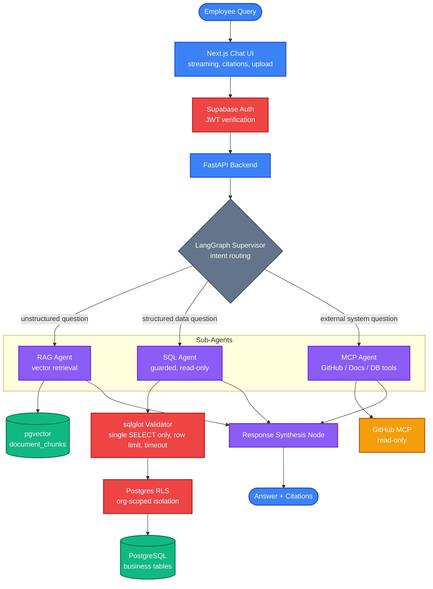

<div align="center">

# ENTERPRISE AI KNOWLEDGE INTELLIGENCE AGENT

### A Secure, Multi-Agent Assistant for Internal Company Knowledge

An internal AI assistant that lets employees ask natural-language questions and get answers automatically sourced and routed across unstructured documents, structured business data, and external systems — without ever letting the LLM run unguarded queries or follow instructions hidden inside retrieved content.

[Documentation](#overview) &nbsp;•&nbsp; [Architecture](#system-architecture) &nbsp;•&nbsp; [Security Model](#security-principles) &nbsp;•&nbsp; [Getting Started](#getting-started)

<br/>


</div>

---

## Table of Contents

- [Overview](#overview)
- [System Architecture](#system-architecture)
- [Query Lifecycle](#query-lifecycle)
- [Security Principles](#security-principles)
- [Key Features](#key-features)
- [Technology Stack](#technology-stack)
- [Getting Started](#getting-started)
- [Repository Structure](#repository-structure)
- [Environment Variables](#environment-variables)
- [Build Plan](#build-plan)
- [Risk Register](#risk-register)
- [Testing](#testing)
- [License](#license)

---

## Overview

Employees ask a question in natural language and the system routes it, automatically, across three sources of truth:

1. **Unstructured knowledge** — PDFs, DOCX, CSV, policies, manuals — retrieved via RAG over a vector index.
2. **Structured business data** — customers, orders, employees — answered by a guarded SQL agent running read-only against the real application database.
3. **External systems** — GitHub initially, Slack and Drive later — accessed through scoped, read-only MCP tool servers.

A supervisor agent built on LangGraph decides which sub-agent (or combination) should handle a given question, then synthesizes a single answer with citations.

Three properties are treated as non-negotiable throughout the design:

- A user query must never surface data the user isn't authorized to see.
- The LLM must never run arbitrary or destructive SQL.
- Content retrieved from a document or tool must never be able to make the agent take an action the user didn't ask for (prompt injection via retrieved content).

---

## System Architecture



**Why this holds up:**

| Principle | How it's achieved |
|---|---|
| Least privilege by default | SQL agent connects with a read-only Postgres role scoped to an explicit table allowlist |
| Defense in depth | Authorization is enforced twice — once at the API layer, once via Postgres RLS |
| Data is never instructions | Retrieved document text and MCP tool results are wrapped in delimiters and explicitly marked as reference material, never as commands |
| No unattended write access | MCP servers start read-only; write actions require an explicit allowlist decision and a UI confirmation step |
| No infinite loops | The supervisor node enforces a max-iteration guard |
| No silent model drift | The embedding model is pinned; the whole index is re-embedded on any change, never mixed |

---

## Query Lifecycle

```
Employee Question
        |
        v
JWT Verification (Supabase Auth)
        |
        v
LangGraph Supervisor — Intent Routing
        |
        +----------------+----------------+
        |                |                |
        v                v                v
   RAG Agent         SQL Agent         MCP Agent
   (vector search,   (sqlglot guard,   (read-only tools,
   org-scoped)       read-only role,   argument-validated)
        |            row limit +       |
        |            timeout)          |
        |                |             |
        +----------------+-------------+
                         |
                         v
              Response Synthesis Node
                         |
                         v
          Answer + Source Citations (streamed)
```

If a question spans multiple sources (for example, "what's our refund policy, and how many refunds did we process last month"), the supervisor triggers both the RAG and SQL agents and merges the results into one answer.

---

## Security Principles

Security is a design property from Phase 1 onward, not a feature bolted on later. Automated proof of these controls is written once, in a dedicated final test pass — but every control listed below is built in from the start.

### Secrets
All API keys, database URLs, and JWT secrets live in `.env`, loaded via Pydantic `BaseSettings`. Nothing is hardcoded. `.gitignore` excludes `.env` from commit one; `.env.example` ships with empty placeholders only.

### File Upload Safety
- Allowlisted file types (PDF, DOCX, CSV, XLSX, TXT) and a max size limit, enforced at the API layer before a file touches disk.
- Processing happens in a sandboxed Celery worker, never inline in the request handler.
- Embedded scripts or macros in DOCX/XLSX are stripped — only text and tables are extracted.
- Files are stored under generated UUIDs, never user-supplied filenames, to prevent path traversal.

### The SQL Agent
The highest-risk component: it runs directly against the real application database, not a demo copy.

- The database role it connects as has `GRANT SELECT` only — even a generated `DROP TABLE` is refused at the database level.
- An explicit table/column allowlist is exposed through `get_schema()`; internal tables such as users, sessions, credentials, and audit logs are never exposed to the schema tool.
- Every generated query passes through a `sqlglot`-based parser that rejects anything other than a single `SELECT` statement — no stacked statements, no DDL/DML, no comment-based smuggling.
- A hard row limit and a query timeout apply to every execution.
- Every query is logged with the user ID that triggered it.

### Prompt Injection From Retrieved Content
Retrieved document text and MCP tool results are treated as data, never as instructions. They're wrapped in the prompt with explicit delimiters and a system instruction that content inside those delimiters must never be followed as a command. A retrieved chunk or tool result can never trigger another tool call on its own — tool calls originate only from the agent reasoning over the user's actual request.

### MCP Server Scoping
Each MCP server exposes the minimum tool set it needs. The GitHub MCP server starts read-only (`search_code`, `read_file`); write actions such as `create_issue` are not wired up until deliberately decided, and are gated behind an explicit user-confirmation step in the UI. Every tool argument is validated against a Pydantic schema before execution.

### Authentication & Authorization
Supabase Auth issues JWTs; every backend endpoint verifies the JWT and derives `user_id`, `org_id`, and `role` from it — a client-supplied user ID is never trusted. Access control is enforced twice: once in the API layer for fast rejection, and once via Postgres Row-Level Security so a missed application-level check still cannot leak data across organizations.

### Transport & API Hygiene
HTTPS only in any deployed environment, an explicit CORS allowlist (no wildcard origins), per-user/IP rate limiting on chat and upload endpoints, and Pydantic validation on every request body — no raw dict access to user input.

---

## Key Features

### Multi-Source Answer Routing
A LangGraph supervisor automatically decides whether a question needs document retrieval, structured data lookup, external tool access, or a combination — and merges the results into a single coherent answer.

### Guarded SQL Agent
Converts natural language into SQL that is validated, row-limited, timeout-bound, and executed under a read-only database role scoped to an explicit table allowlist.

### Retrieval-Augmented Generation
Documents are chunked, embedded with a pinned embedding model, and stored in pgvector; retrieval is always scoped to the requesting user's organization.

### MCP Tool Integration
Document, database, and GitHub tools are exposed through the Model Context Protocol, each scoped to the minimum permissions it needs and validated on every call.

### Streaming Chat With Citations
Answers stream token-by-token to the frontend. RAG-sourced answers show clickable source chips; SQL-sourced answers show the executed query on request, collapsed by default.

### Background Ingestion
Document extraction and embedding run as Celery tasks, so large uploads never block the API and failures are retried rather than silently dropped.

### Row-Level Security by Default
Every table holding organization-scoped data is protected by Postgres RLS policies, not just application-level checks — a defense-in-depth guarantee against a missed authorization check.

---

## Technology Stack

<table>
<tr>
<td valign="top" width="50%">

**Frontend**


</td>
<td valign="top" width="50%">

**Backend**


</td>
</tr>
<tr>
<td valign="top" width="50%">

**Agent Orchestration**


</td>
<td valign="top" width="50%">

**Data & Storage**


</td>
</tr>
<tr>
<td valign="top" width="50%">

**LLMs & Embeddings**


</td>
<td valign="top" width="50%">

**Infra & Observability**


</td>
</tr>
</table>

| Technology | Role in the Project |
|---|---|
| Next.js 15 (App Router) | Frontend framework and streaming chat UI |
| Vercel AI SDK | Token-level streaming without hand-rolled SSE parsing |
| FastAPI + Pydantic v2 | REST API layer with strict request/response validation |
| SQLAlchemy 2.0 (async) + Alembic | ORM and schema migrations |
| LangGraph | Supervisor + sub-agent orchestration |
| LangChain | Document loaders, retrievers, and prompt templates |
| Google Gemini Flash | Primary LLM |
| Groq (Llama 3.3 70B) | Fallback LLM |
| BAAI/bge-small-en-v1.5 | Local embedding model, pinned per Section on model drift |
| PostgreSQL + pgvector (Supabase) | Combined relational and vector storage |
| Supabase Auth | JWT-based authentication |
| Postgres RLS | Row-level, org-scoped data isolation |
| Celery + Redis | Background document ingestion |
| PyMuPDF / python-docx / pandas + openpyxl | PDF, DOCX, and spreadsheet extraction |
| Model Context Protocol (official Python SDK) | Document, Database, and GitHub tool servers |
| Loguru + Sentry + LangSmith | Structured logging, error tracking, and agent trace visibility |

---

## Getting Started

### Prerequisites

- Python 3.11 or later
- Node.js 18 or later
- Docker and Docker Compose
- `uv` or `poetry` for backend dependency management
- API keys for Gemini and Groq, and a Supabase project

### Backend Setup

```bash
cd backend
uv sync              # or: poetry install
cp ../.env.example ../.env   # fill in real values
uvicorn app.main:app --reload
```

### Frontend Setup

```bash
cd frontend
npm install
npm run dev
```

### Full Stack (Local)

```bash
docker compose up
```

This starts PostgreSQL and Redis locally. The frontend runs at `http://localhost:3000`, and the backend API at `http://localhost:8000`.

---

## Repository Structure

```
enterprise-ai-agent/
├── CLAUDE.md
├── .env.example
├── .gitignore
├── docker-compose.yml
├── backend/
│   ├── pyproject.toml
│   ├── app/
│   │   ├── main.py
│   │   ├── config.py           # Pydantic BaseSettings, reads .env
│   │   ├── api/                # FastAPI routers
│   │   ├── agents/              # LangGraph supervisor + sub-agents
│   │   ├── rag/                 # ingestion, chunking, retrieval
│   │   ├── sql_agent/            # guarded SQL generation + execution
│   │   ├── mcp_servers/          # document / database / github MCP servers
│   │   ├── db/                   # SQLAlchemy models, migrations (alembic)
│   │   ├── security/              # auth, RLS helpers, input validation, rate limiting
│   │   └── workers/                # Celery tasks
│   └── tests/
│       ├── unit/
│       ├── integration/
│       └── security/            # SQLi attempts, prompt-injection attempts, auth bypass
└── frontend/
    ├── package.json
    └── src/
        ├── app/
        ├── components/
        └── lib/
```

---

## Environment Variables

```
# Database
DATABASE_URL=
SUPABASE_URL=
SUPABASE_ANON_KEY=
SUPABASE_SERVICE_ROLE_KEY=

# LLMs
GEMINI_API_KEY=
GROQ_API_KEY=

# Redis / Celery
REDIS_URL=

# Auth
JWT_SECRET=

# Observability
SENTRY_DSN=
LANGSMITH_API_KEY=

# GitHub MCP
GITHUB_TOKEN=
```

None of these values are committed. `.env.example` documents the required keys with empty placeholders only.

---

## Build Plan

The system is built in fifteen phases (0 through 14), one at a time, with static verification (typecheck, lint, targeted manual sanity checks) at every phase. The full automated test suite — unit, integration, and a dedicated security suite covering SQL injection, prompt injection, and auth bypass — is written once, at the end, against the fully assembled system.

| Phase | Focus |
|---|---|
| 0 | Monorepo scaffolding, health check, Docker Compose |
| 1 | Backend config, DB connection, structured logging, global error handling |
| 2 | Database schema and Row-Level Security policies |
| 3 | Document ingestion pipeline (upload, extract, chunk, embed) |
| 4 | RAG retrieval and streaming chat, no SQL/MCP yet |
| 5 | Guarded SQL agent against real business tables |
| 6 | MCP servers — Document, Database, GitHub (read-only) |
| 7 | LangGraph supervisor with multi-agent routing |
| 8 | Frontend chat UI — streaming, citations, upload |
| 9 | Auth and RBAC integration on the frontend |
| 10 | Background job hardening — retries, dead-letter handling |
| 11 | Observability — Sentry, LangSmith, correlated logs |
| 12 | Design-level security hardening review |
| 13 | Dockerization and deployment |
| 14 | Full automated test pass — unit, integration, security, dependency audit |

---

## Risk Register

| Risk | Why It Happens | Mitigation |
|---|---|---|
| Vector search returns garbage after a model change | Query embedded with a different model than the stored chunks | Embedding model version is pinned; the whole index is re-embedded on any change, never mixed |
| SQL agent touches unintended tables | Schema tool exposes more than it should | Explicit table allowlist in `get_schema()`; full DB is never introspected automatically |
| SQL agent runs against real data with deferred automated proof | Testing is intentionally deferred to the final phase | Allowlist kept as narrow as possible per phase; a manual injection check is run the moment the agent exists |
| LLM rate limits stall production | Single-provider dependency | Gemini to Groq fallback wired in from the RAG phase, not bolted on later |
| Large upload blocks the API | Synchronous processing in the request handler | All ingestion runs as a Celery task from the ingestion phase onward |
| Prompt injection via a malicious uploaded document | Retrieved text treated as instructions | Delimiter and system-instruction pattern, formally tested in the final phase |
| Agent loops forever | No termination condition in the graph | Explicit max-iteration guard on the supervisor node |
| Data leak across organizations | Missing or bypassed authorization check | Both API-layer checks and Postgres RLS enforced; formally tested in the final phase |
| Secrets committed to git | `.env` accidentally staged | `.gitignore` from commit one, `.env.example` only, pre-commit secret scan |
| Cost or quota overrun | Free-tier limits hit silently | Token usage logged per request; alert threshold configured in the observability phase |
| Malformed or oversized file crashes a worker | No size/type validation before processing | Limits enforced before a file reaches the extraction library |
| A bug from an early phase isn't caught until the final phase | Per-phase testing deferred by design | A dedicated hardening review phase exists specifically to catch design-level issues before the formal suite |

---

## Testing

The full test suite is written and run once, after the system is running end to end, against the fully assembled application — not incrementally per phase.

```bash
# Backend
cd backend
pytest tests/unit tests/integration tests/security -v
pip-audit

# Frontend
cd frontend
npx vitest
npx playwright test
npm audit
```

Coverage includes:

- Cross-organization RLS isolation
- Document ingestion correctness
- RAG citation accuracy and honest "I don't know" behavior
- SQL agent rejection of injection and stacked-query attempts
- MCP tool argument validation
- Agent routing and max-iteration guard behavior
- Auth bypass attempts — missing JWT, wrong `org_id`, expired token
- File upload fuzzing — oversized files, disallowed types, zip bombs

---

## License

This project is currently unlicensed. Add a license file if you intend to distribute or open-source this project.

---

<div align="center">

Built with LangGraph, FastAPI, and Next.js

</div>
