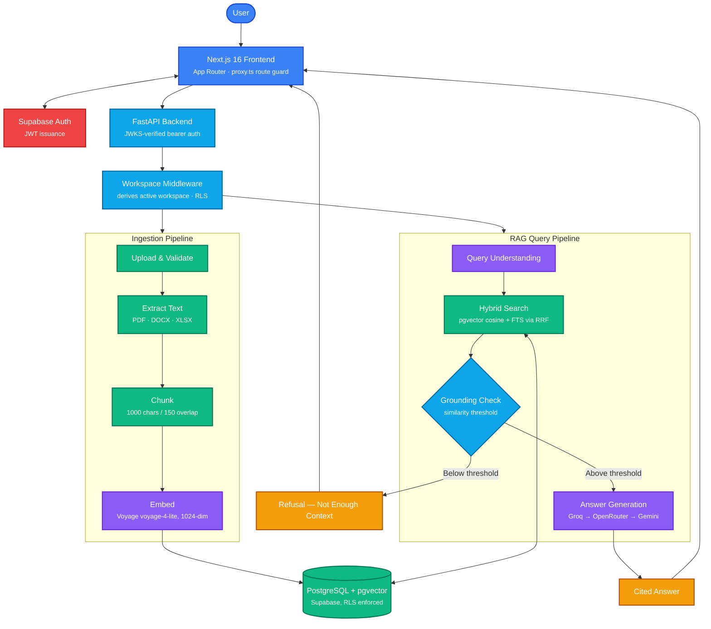
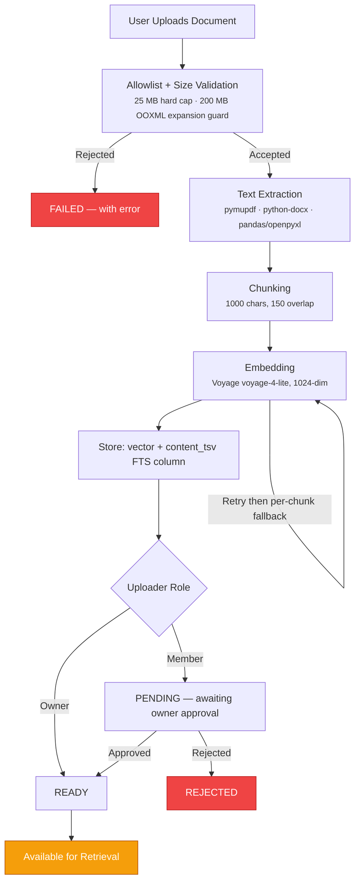
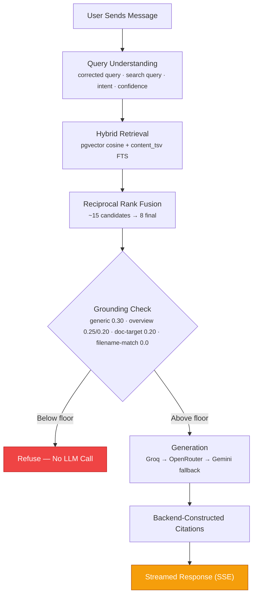

<div align="center">

# Office Brain

### An AI Knowledge Assistant Built on Retrieval-Augmented Generation

Office Brain lets teams upload their documents into workspaces and chat with an AI assistant that answers strictly from that content — with backend-verified citations, multi-tenant access control, and automatic LLM provider fallback for high availability.

[Live App](https://office-brain.vercel.app/login) &nbsp;•&nbsp; [Report a Bug](#) &nbsp;•&nbsp; [Request a Feature](#)

<br/>


</div>

---

## Table of Contents

- [Overview](#overview)
- [System Architecture](#system-architecture)
- [Document Ingestion Workflow](#document-ingestion-workflow)
- [RAG Query Workflow](#rag-query-workflow)
- [Key Features](#key-features)
- [Technology Stack](#technology-stack)
- [Getting Started](#getting-started)
- [Project Structure](#project-structure)
- [Environment Variables](#environment-variables)
- [API Surface](#api-surface)
- [Security](#security)
- [Testing](#testing)
- [Deployment](#deployment)
- [Roadmap](#roadmap)
- [License](#license)

---

## Overview

Office Brain turns a workspace's documents into a queryable knowledge base. Users upload files, which are validated, chunked, embedded, and indexed; they then chat with an assistant that retrieves the most relevant passages, checks that the match is strong enough to trust, and generates an answer with citations back to the source documents — refusing to answer when no passage is a confident enough match.

The system is built around three core principles:

- **Multi-tenant by design.** Every workspace-owned record carries a `workspace_id`, enforced by both application middleware and PostgreSQL Row-Level Security (RLS).
- **Grounded, not guessed.** Retrieval results are checked against similarity thresholds before generation is even attempted — if nothing in the workspace is relevant, the assistant says so instead of hallucinating an answer.
- **Resilient by default.** Every external dependency — embeddings, LLM generation, ingestion jobs — has a fallback path, a timeout, and a retry strategy, so a single provider outage doesn't take down the assistant.

---

## System Architecture



### Why This Architecture Holds Up

| Principle | How It's Achieved |
|---|---|
| **Multi-tenant isolation** | Every workspace-owned table carries `workspace_id`; enforced at both the middleware and PostgreSQL RLS layers |
| **Grounded generation** | Absolute cosine similarity floors are checked *before* any generation call — no match, no hallucinated answer |
| **Auth boundary clarity** | `proxy.ts` in the frontend does optimistic route protection only; the backend + RLS are the real authorization boundary |
| **Provider resilience** | LLM fallback chain (Groq → OpenRouter → Gemini) plus an NVIDIA rotating tier, with generic labels hiding internal model choice |
| **Deterministic ingestion** | Extraction, chunking, and embedding are Python-controlled and reproducible; the LLM is never in the ingestion critical path |
| **Operational safety nets** | Streaming upload size ceilings, zip-bomb guards, a stale-job reaper, and Sentry-backed error capture |

---

## Document Ingestion Workflow



A background reaper sweeps stale ingestion jobs every 300 seconds (kill-switchable via `INGESTION_REAPER_ENABLED`), so a crashed or hung job never leaves a document stuck mid-pipeline.

---

## RAG Query Workflow



Two design decisions are worth calling out:

- **Refusal happens before generation.** If retrieved passages fall below the similarity floor, the pipeline stops before calling the LLM — saving cost and avoiding ungrounded answers.
- **Citations are backend-constructed, not model-generated.** The LLM writes the answer text; the backend independently maps that answer back to the retrieved chunks, so citations can't drift from what was actually retrieved.

Conversation memory uses a hybrid strategy — recent turns kept verbatim, older turns summarized — with hard caps on token usage per session.

---

## Key Features

### Multi-Tenant Workspaces
Every user belongs to one or more workspaces with `OWNER` or `MEMBER` roles. An invite-accept flow handles onboarding, and a workspace-switch middleware layer resolves the active workspace on every request.

### Secure, Standards-Based Authentication
Identity is managed by Supabase Auth. The backend independently verifies bearer JWTs against the project's JWKS endpoint (supporting ES256, RS256, and HS256, with configurable leeway and key caching) rather than trusting the frontend's session state.

### Resilient Ingestion Pipeline
Uploads pass through an allowlist and streaming size checks — including a dedicated zip-bomb guard for OOXML formats — before extraction, chunking, and embedding. A configurable approval workflow lets workspace owners review member-uploaded documents before they become searchable.

### Hybrid Retrieval with Grounding Guarantees
Combines dense vector search (pgvector cosine similarity) with full-text search (PostgreSQL FTS), merged via Reciprocal Rank Fusion. Multiple similarity floors — tuned separately for generic queries, overview questions, and high-confidence document targeting — determine whether the system is confident enough to answer at all.

### Multi-Provider LLM Resilience
A plain HTTP OpenAI-compatible client (no SDK lock-in) drives a fallback chain across Groq, OpenRouter, and Gemini, plus a rotating NVIDIA tier. User-facing labels are generic (primary / fallback / secondary fallback / rotating), keeping the underlying model choice an internal implementation detail.

### Cited, Streamed Answers
Responses stream to the client over Server-Sent Events, with citations constructed by the backend from the actual retrieved chunks — not asserted by the model.

### Conversation Memory Management
A hybrid memory strategy summarizes older conversation turns while keeping recent turns verbatim, with configurable token caps to keep context windows and costs predictable.

### Operational Observability
Sentry integration captures errors with configurable release tagging and trace sampling, plus a token-usage alert threshold to catch runaway LLM costs early.

---

## Technology Stack

<table>
<tr>
<td valign="top" width="50%">

**Frontend**


</td>
<td valign="top" width="50%">

**Backend**


-D71F00?style=flat-square&logo=python&logoColor=white)


</td>
</tr>
<tr>
<td valign="top" width="50%">

**Data & Retrieval**


</td>
<td valign="top" width="50%">

**AI / LLM Providers**


</td>
</tr>
<tr>
<td valign="top" width="50%">

**Auth & Security**


</td>
<td valign="top" width="50%">

**Deployment & Observability**


</td>
</tr>
</table>

| Technology | Role in the Project |
|---|---|
| Next.js 16 (App Router) | Frontend framework and routing; `proxy.ts` replaces the Next 15 `middleware.ts` convention |
| React 19 | Interactive UI components |
| TypeScript | Type safety across the frontend |
| Tailwind CSS v4 | Styling system |
| Supabase SSR / Supabase JS | Authentication and session handling |
| FastAPI | Async REST API layer |
| SQLAlchemy (async) + asyncpg | ORM and async Postgres driver (no psycopg2 in the dependency tree) |
| Alembic | Schema migrations (18 linear versions) |
| Pydantic v2 | Request/response validation and centralized settings management |
| PyJWT | JWKS-based bearer token verification |
| PostgreSQL (Supabase) | Primary datastore |
| pgvector | Vector similarity search (1024-dim HNSW index) |
| PostgreSQL FTS | Full-text search, fused with vector search via RRF |
| Voyage AI (`voyage-4-lite`) | Embedding generation, 1024 dimensions |
| Groq / OpenRouter / Gemini / NVIDIA | LLM generation with automatic fallback and rotation |
| loguru | Structured backend logging |
| slowapi | Rate limiting |
| Sentry | Error tracking and performance monitoring |
| Render | Backend deployment, auto-migrating on deploy |
| Vercel | Frontend deployment |

---

## Getting Started

### Prerequisites

- Python 3.11 or later
- Node.js 18 or later
- npm, yarn, or pnpm
- A Supabase project (for Auth and Postgres/pgvector)
- API keys for at least one LLM provider (Groq, Gemini, or OpenRouter) and for Voyage AI (embeddings)

### Backend Setup

```bash
cd backend
python -m venv venv
source venv/bin/activate      # On Windows: venv\Scripts\activate
pip install -e .
alembic upgrade head
uvicorn app.main:app --reload
```

### Frontend Setup

```bash
cd frontend
npm install
npm run dev
```

The frontend will be available at `http://localhost:3000` and the backend API at `http://localhost:8000` by default.

---

## Project Structure

```
office-brain/
├── backend/
│   ├── app/
│   │   ├── api/            # FastAPI route definitions
│   │   ├── db/              # SQLAlchemy models and session management
│   │   ├── ingestion/        # Upload validation, extraction, chunking, embedding
│   │   ├── retrieval/         # Hybrid search, RRF, grounding, citation construction
│   │   ├── llm/                 # Provider clients and fallback/rotation logic
│   │   ├── security/             # Upload allowlist, JWT verification
│   │   ├── errors.py               # Centralized exception handling
│   │   ├── config.py                # Pydantic settings, env parsing, validation
│   │   └── main.py                   # App entrypoint and lifespan
│   ├── alembic/                        # 18 linear migration versions
│   ├── scripts/
│   │   ├── backfill_embeddings.py        # Paced re-embedding with dim-check + seal-gate
│   │   ├── verify_no_torch.py             # Confirms an ML-free dependency tree
│   │   └── dev_auth_schema.sql             # Local RLS/auth bootstrap for bare Postgres
│   ├── tests/                                # 55 files, 1,000+ tests
│   ├── render.yaml
│   └── pyproject.toml
├── frontend/
│   ├── src/
│   │   ├── app/                                # Next.js pages and routes
│   │   ├── components/                          # React components and UI elements
│   │   ├── lib/
│   │   │   ├── api/client.ts                      # Typed backend API client
│   │   │   └── auth.tsx                            # Supabase auth context
│   │   └── proxy.ts                                 # Next.js 16 middleware (route guard)
│   ├── public/
│   └── package.json
├── CLAUDE.md                                          # Live architectural source of truth
└── README.md
```

---

## Environment Variables

The backend loads configuration from `.env` files via a centralized Pydantic settings module, which fails fast at boot if required values are missing or invalid.

| Category | Key Variables |
|---|---|
| Core | `ENVIRONMENT`, `DEBUG`, `DATABASE_URL`, `CORS_ALLOW_ORIGINS` |
| Supabase | `SUPABASE_URL`, `SUPABASE_ANON_KEY`, `SUPABASE_SERVICE_ROLE_KEY` |
| Auth | `JWT_SECRET` (local fallback only), `JWT_ALGORITHMS`, `JWKS_CACHE_SECONDS`, `JWT_LEEWAY_SECONDS` |
| LLM Providers | `GROQ_API_KEY`, `GEMINI_API_KEY`, `OPENROUTER_API_KEY`, `NVIDIA_API_KEY`, `OPENROUTER_MODEL`, `NVIDIA_MODEL`, `LLM_PROVIDER` / `MODEL` / `API_KEY` / `BASE_URL`, `LLM_TEMPERATURE`, `LLM_MAX_OUTPUT_TOKENS`, `LLM_MAX_OUTPUT_TOKENS_CAP`, `LLM_TIMEOUT_SECONDS` |
| Embeddings | `EMBEDDING_PROVIDER`, `EMBEDDING_MODEL`, `VOYAGE_API_KEY`, `EMBEDDING_DIMENSION`, `EMBEDDING_TIMEOUT_SECONDS`, `EMBEDDING_MAX_ATTEMPTS`, `EMBEDDING_BATCH_SIZE` |
| Ingestion | `UPLOAD_DIR`, `MAX_UPLOAD_BYTES`, `MAX_UPLOAD_SIZE_MB`, `MAX_EXTRACTED_BYTES`, `CHUNK_SIZE`, `CHUNK_OVERLAP`, `INGESTION_REAP_INTERVAL_SECONDS`, `INGESTION_REAPER_ENABLED` |
| Retrieval | `RETRIEVAL_TOP_K`, `RETRIEVAL_MAX_DISTANCE`, `RETRIEVAL_MAX_CONTEXT_CHARS`, `RETRIEVAL_CANDIDATE_COUNT`, `RETRIEVAL_FINAL_COUNT`, `RETRIEVAL_RELEVANCE_THRESHOLD`, `OVERVIEW_MIN_SCORE`, `OVERVIEW_AGGREGATE_MIN`, `DOC_TARGET_HIGH_CONFIDENCE`, `DOC_TARGET_RELAXED_SCORE`, `FILENAME_MATCH_RELAXED_SCORE` |
| Memory | `CHAT_HISTORY_LIMIT`, `MEMORY_MAX_TOKENS`, `MEMORY_SUMMARY_THRESHOLD`, `MEMORY_RECENT_WINDOW`, `MEMORY_STRATEGY` |
| Demo Mode | `DEMO_ENABLED`, `DEMO_WORKSPACE_NAME`, `DEMO_WORKSPACE_ID`, `DEMO_GUEST_TTL_HOURS` |
| Observability | `SENTRY_DSN`, `SENTRY_RELEASE`, `SENTRY_TRACES_SAMPLE_RATE`, `SENTRY_EVENT_LEVEL`, `TOKEN_USAGE_ALERT_THRESHOLD` |
| Misc | `GITHUB_TOKEN` |
| Frontend | `NEXT_PUBLIC_API_URL`, `NEXT_PUBLIC_SUPABASE_URL`, `NEXT_PUBLIC_SUPABASE_ANON_KEY` |

> A `postgresql://` connection string is automatically rewritten to `postgresql+asyncpg://` at boot, since the async driver is the only one installed — this avoids a confusing `ModuleNotFoundError` if a Supabase-style URL is pasted in directly.

---

## API Surface

| Area | Endpoints |
|---|---|
| Health | `GET /health` |
| Auth | `POST /auth/check-email`, `GET /me` |
| Chat | `POST /chat` (SSE), `POST /chat/grounded`, `GET /chat/sessions`, `GET /chat/sessions/{id}/messages`, `DELETE /chat/sessions/{id}` |
| Documents | `POST /documents`, `GET /documents`, `GET /documents/{id}/download`, `POST /documents/{id}/approve`, `POST /documents/{id}/reject`, `DELETE /documents/{id}` |
| Workspaces | `POST /workspaces`, `GET /workspaces`, `GET`/`PATCH`/`DELETE /workspaces/{id}`, `GET`/`PATCH`/`DELETE /workspaces/{id}/members[/{member_id}]`, `POST`/`GET /workspaces/{id}/invitations`, `GET /workspaces/{id}/stats` |
| Onboarding | Invite-accept flow, `POST /demo/enter` |

---

## Security

- **Authentication:** Supabase-issued JWTs, independently verified against the project JWKS (ES256 / RS256 / HS256) — the frontend's session state is never trusted on its own.
- **Authorization:** Workspace-scoped access enforced at both the application layer (middleware-derived active workspace) and the database layer (PostgreSQL Row-Level Security).
- **Upload safety:** File-type allowlisting, streaming size ceilings, and a dedicated guard against OOXML zip-bomb expansion.
- **Rate limiting:** `slowapi`-based request throttling, with demo mode disabled in production.
- **Secrets hygiene:** All credentials loaded via environment variables (`SecretStr`-typed where applicable); `.env` files are git-ignored; no secrets are tracked in the repository.
- **Network exposure:** Health-check-only ingress; CORS restricted to an explicit allowlist.
- **Error monitoring:** Sentry captures exceptions with configurable severity thresholds and release tagging.

---

## Testing

Backend tests can be run from the `backend` directory:

```bash
python -m pytest tests/
```

The suite spans **55 test files** covering unit, integration, and security scenarios, including configuration validation, embedding generation and fallback, retrieval and grounding thresholds, resilience/fallback behavior, and URL-normalization edge cases. Linting is enforced with Ruff (`E`, `F`, `I`, `B`, `UP`, `S` rule sets).

---

## Deployment

- **Backend** deploys to Render (`render.yaml`): installs via `pip install -e .`, runs `alembic upgrade head` as a pre-deploy step, and serves with Uvicorn on the platform-assigned port. Health checks hit `/health`.
- **Frontend** deploys to Vercel, built on Next.js 16.
- Pushing to `main` triggers an automatic deploy on both platforms; database migrations are applied automatically on every backend deploy.

---

## Roadmap

- [ ] Refresh embedding stack documentation and remove references to legacy 384-dim models
- [ ] Extend `.env.example` to cover all default-backed and advanced configuration variables
- [ ] Prune unused static frontend assets to reduce repository size
- [ ] Add a CI pipeline for automated test runs and linting on pull requests
- [ ] Containerize the backend for consistent local and CI environments
- [ ] Surface *why* a chunk was retrieved (retrieval-scoring explainability)
- [ ] Support additional document formats (Markdown, HTML, compressed archives)
- [ ] Add persistent analytics on token usage and retrieval quality over time

---

## License

This project is currently unlicensed. Add a license file if you intend to distribute or open-source this project.

---

<div align="center">

Built by [Aarya Makthala](https://github.com/AaryaMakthala)

</div>
